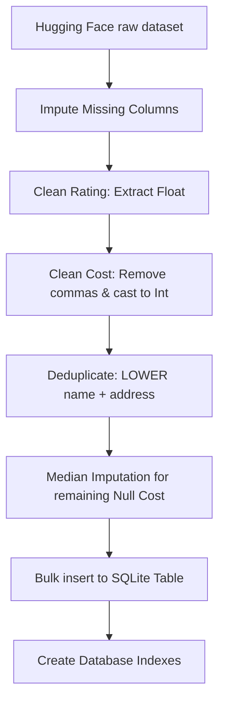
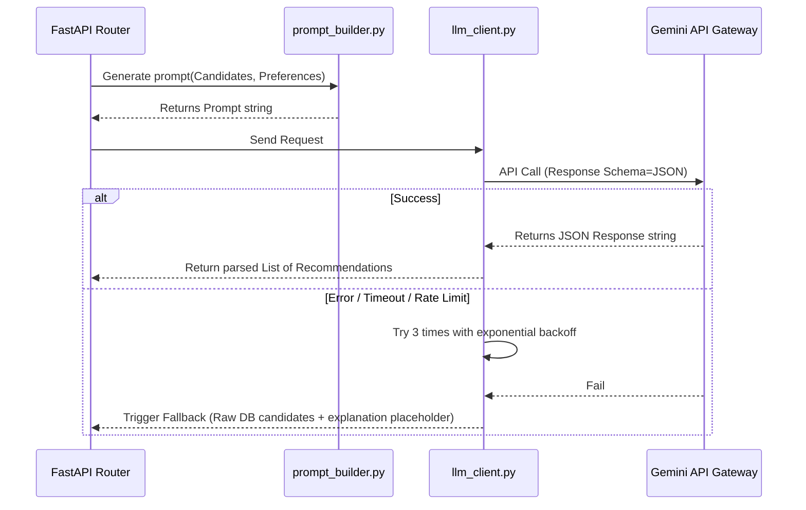

# Exhaustive Reference Architecture: Zomato AI Recommendation System

This document outlines the detailed architecture specification for the Zomato AI Restaurant Recommendation Service, serving as a comprehensive design system for all modules, database schemas, heuristics, API contracts, UI styles, and QA tests.

---

## 1. High-Level Flow & File Organization

The application splits responsibilities into structured pipelines to keep database searches fast, client styles beautiful, and AI requests cost-effective.

```text
Zomato-AI-Recommendation/
├── Docs/
│   ├── Problem Statement.md
│   ├── Summary.md
│   └── Architecture.md               # Exhaustive Architecture Blueprint
├── src/
│   └── zomato_ai/
│       ├── __init__.py               # Package metadata and version info
│       ├── config.py                 # Configuration validation via Pydantic Settings
│       ├── phase1/
│       │   ├── __init__.py
│       │   └── ingestion.py          # Data fetching, pandas cleaning, SQLite loading
│       └── phase2/
│           ├── __init__.py
│           ├── models.py             # Pydantic schemas for API inputs & DB outputs
│           ├── repository.py         # DB connection management and database queries
│           ├── filtering.py          # Pre-filtering logic & heuristic ranking maths
│           └── api.py                # FastAPI endpoints, CORS, static mounts
├── frontend/                         # Premium Next.js Frontend Portal (Turbopack, TS)
│   ├── src/
│   │   ├── app/                      # Page Routing Structure (/, /preferences, /recommendations, /restaurant/[name])
│   │   │   ├── globals.css           # Premium GourmetAI styling sheet
│   │   │   ├── layout.tsx            # Global Navigation Header and Footer
│   │   │   └── page.tsx              # Discovery Home View
│   │   └── context/
│   │       └── AppContext.tsx        # React global state context manager
│   ├── package.json
│   └── tsconfig.json
├── .env.example                      # Config configuration template
├── requirements.txt                  # Python dependencies
└── README.md                         # Setup and execution guides
```

---

## 2. Ingestion & Preprocessing Architecture (Phase 1)

This phase manages downloading the raw Bangalore dataset, cleaning it via Pandas vector functions, saving it to SQLite, and optimizing query indexing.

### Cleansing Blueprint
Raw scraped data contains formatting inconsistencies, missing entries, and string-formatted numeric fields. The ingestion pipeline executes the following checks sequentially:



### Cleansing Logic Specification

1.  **Column Subset Filters**: Keep only fields required for search filtering, UI rendering, and LLM reasoning:
    *   `name`, `url`, `address`, `online_order`, `book_table`, `rate`, `votes`, `phone`, `location`, `rest_type`, `dish_liked`, `cuisines`, `approx_cost(for two people)`, `reviews_list`, `listed_in(type)`, `listed_in(city)`.
2.  **Imputation Defaults**:
    *   Drop rows where `location` is null.
    *   Map null `cuisines` to `"Unknown Cuisines"`.
    *   Map null `online_order` & `book_table` to `"No"`.
3.  **Rate Cleansing Math**:
    *   Input: text (e.g. `"4.1/5"`, `"NEW"`, `"-"`, `NaN`).
    *   Transformation:
        *   Split at `"/"` to isolate numerator.
        *   Discard `"NEW"` or `"-"` by converting to Python `None`.
        *   Strip whitespace and parse as float.
4.  **Cost Cleansing Math**:
    *   Input: text (e.g. `"1,200"`, `NaN`).
    *   Transformation:
        *   Use regular expression `[^\d]` to remove non-numeric characters.
        *   Cast to float.
5.  **Multi-Tier Median Cost Imputation**:
    *   *Tier 1 (Specific)*: Compute median cost of restaurants grouped by `[location, rest_type]`. Impute null costs in corresponding groups.
    *   *Tier 2 (Broad)*: For remaining nulls, compute median cost grouped by `[location]`.
    *   *Tier 3 (Global)*: If still null, fill with global database median.
    *   *Output*: Cast values to integers.
6.  **Compound Deduplication**:
    *   Keep first record where `LOWER(TRIM(name))` and `LOWER(TRIM(address))` match.

### Database Target Schema & DDL
```sql
CREATE TABLE IF NOT EXISTS restaurants (
    id INTEGER PRIMARY KEY AUTOINCREMENT,
    name TEXT NOT NULL,
    url TEXT,
    address TEXT,
    online_order TEXT CHECK(online_order IN ('Yes', 'No')),
    book_table TEXT CHECK(book_table IN ('Yes', 'No')),
    rate REAL,               -- Floating rating (e.g. 4.1)
    votes INTEGER,           -- Total vote count (e.g. 150)
    phone TEXT,
    location TEXT,           -- Neighborhod/District (e.g., HSR)
    rest_type TEXT,          -- Restaurant category (e.g., Quick Service)
    dish_liked TEXT,
    cuisines TEXT,           -- Comma-separated list (e.g. Chinese, Thai)
    approx_cost INTEGER,     -- Standardized price (e.g. 400)
    reviews_list TEXT,
    listed_in_type TEXT,
    listed_in_city TEXT
);

-- Optimization Indexes for fast searches
CREATE INDEX IF NOT EXISTS idx_restaurants_location ON restaurants(location);
CREATE INDEX IF NOT EXISTS idx_restaurants_cost ON restaurants(approx_cost);
CREATE INDEX IF NOT EXISTS idx_restaurants_rate ON restaurants(rate);
```

---

## 3. Backend & Heuristic Scoring Engine (Phase 2)

Exposes endpoints via FastAPI, filters the SQLite database via parameterized queries, and applies normalizations to select the top candidate restaurants.

### API Schemas (Pydantic Models)
We validate all inputs and outputs using Pydantic schemas.

```python
from pydantic import BaseModel, Field
from typing import List, Optional

class RecommendationRequest(BaseModel):
    location: str = Field(..., examples=["Indiranagar"], min_length=2)
    min_budget: int = Field(default=0, ge=0)
    max_budget: int = Field(default=99999, ge=0)
    cuisine: Optional[str] = Field(default="")
    min_rating: float = Field(default=0.0, ge=0.0, le=5.0)
    additional_preferences: Optional[str] = Field(default="")

class RestaurantResponse(BaseModel):
    name: str
    cuisine: str
    rating: Optional[float]
    approx_cost: int
    Location: str
    ai_explanation: str

class RecommendationResponse(BaseModel):
    recommendations: List[RestaurantResponse]
```

### SQLite Query Matching Strategies
The backend uses SQL queries to extract data:

```sql
SELECT 
    name, url, address, online_order, book_table, rate, votes, 
    phone, location, rest_type, dish_liked, cuisines, approx_cost
FROM restaurants
WHERE 
    LOWER(listed_in_city) LIKE :locality_pattern
    AND rate >= :min_rating
    AND approx_cost BETWEEN :min_budget AND :max_budget
    -- Optional (dynamically appended only if cuisine is provided):
    AND LOWER(cuisines) LIKE :cuisine_pattern;

#### Mapping Parameters:
1.  **Locality Pattern**: `:locality_pattern = '%' + location.lower() + '%'` (fuzzy substring checking of the broader listed locality/city).
2.  **Budget Mapping**: Passes `min_budget` and `max_budget` parameters directly as bounds for `approx_cost`.
3.  **Cuisine Pattern**: (Optional) `:cuisine_pattern = '%' + cuisine.lower() + '%'. Only filtered if a non-empty cuisine is specified.`
4.  **Deduplication Constraint**: Unique constraints on the restaurant `name` are enforced at the API response layer to prevent presenting duplicate restaurants.

### Heuristic Scoring Formula
To pick the top 20 restaurants from the matches to send to the LLM, we calculate a compound heuristic score for each candidate:

$$S_{\text{final}} = (S_{\text{rating}} \times 0.70) + (S_{\text{votes}} \times 0.30)$$

Where:
*   **Normalized Rating ($S_{\text{rating}}$)**:
    $$S_{\text{rating}} = \frac{\text{Rate} - 1.0}{4.0}$$
    *(Ensures rating is scaled from 0.0 to 1.0, mapping 1.0 to 0.0 and 5.0 to 1.0)*
*   **Log-Scaled Votes ($S_{\text{votes}}$)**:
    $$S_{\text{votes}} = \frac{\ln(\text{Votes} + 1)}{\ln(\text{MaxVotes} + 1)}$$
    *(Handles exponential vote distribution so highly popular restaurants receive a fair boost without overriding the rating)*

Candidates are sorted descending by $S_{\text{final}}$ to pick the top 20 (deduplicated by name).

---

## 4. LLM Integration & Prompt Design (Phase 3)

Coordinates structured communication with the LLM API using the Python Gemini SDK.



### Prompt Engineering Specification
The prompt engineering system sends instructions and JSON context to the model.

#### Model Parameters
*   **Target Model**: `gemini-2.5-flash` (or `gemini-2.5-pro` for complex parsing)
*   **Temperature**: `0.2` (low temperature keeps responses grounded and logical)
*   **Response Schema**: Set output structure explicitly using system instructions.

#### Prompt Template Definition
```text
System Prompt:
You are an expert foodie concierge matching users with restaurant recommendations.
Your objective is to analyze the candidate restaurants and recommend them to the user.

Rules:
1. Recommend ALL restaurants from the provided Candidate List that match the user's preferences. Do not arbitrarily exclude or drop any candidates. If the preferred cuisine is 'Any Cuisine' or not specified, the user is requesting a general recommendation; in this case, recommend a broad and diverse set of high-quality options from the list (at least 8-12 restaurants if they fit budget and rating) to provide a rich variety of choices.
2. Provide a personalized "ai_explanation" for each restaurant. Explain why it matches the user's preferences (such as cuisine if specified, budget, rating, and any additional vibe constraints).
3. Keep the tone friendly, helpful, and concise.

Output format must be a valid JSON array matching this structure:
[
  {
    "name": "Exact Restaurant Name",
    "cuisine": "Cuisines served",
    "rating": float_rating,
    "approx_cost": int_cost,
    "ai_explanation": "Custom reasoning explaining how it fits the preferences."
  }
]

User Preferences:
- Target Location: {location}
- Selected Cuisine: {cuisine}
- Budget Category: {budget}
- Custom Constraints: {additional_preferences}

Candidate List Context:
{candidates_json_string}
```

#### Safe Fallback Python Signature
If the LLM client encounters a terminal error (e.g. invalid API key, network failure), it triggers the following backup processor to keep the app working:

```python
def generate_fallback_response(candidates: List[dict], user_pref: dict) -> List[dict]:
    """Generates backup recommendations if the LLM API fails."""
    recommendations = []
    # Take the top 5 candidates based on heuristic sorting
    for item in candidates[:5]:
        recommendations.append({
            "name": item["name"],
            "cuisine": item["cuisines"],
            "rating": item["rate"],
            "approx_cost": item["approx_cost"],
            "Location": item["location"],
            "ai_explanation": (
                f"Highly recommended restaurant in {item['location']} serving {item['cuisines']} "
                f"for an average cost of {item['approx_cost']} for two. This option is selected based on "
                f"its rating of {item['rate']}/5 with {item['votes']} reviews from the community."
            )
        })
    return recommendations
```

---

## 5. UI Architecture (Phase 4)

The frontend is a premium single-page application built on Next.js 16 (App Router) using TypeScript and Vanilla CSS. It provides dynamic transitions, responsive layouts, and integrates with the backend APIs via standard HTTP endpoints.

### Layout Routing & Views
We implement dynamic routing corresponding to the GourmetAI interface pages:
- **`Layout` (`/src/app/layout.tsx`)**: Global header containing the logo, links (`Home`, `Discover`), search buttons, and profile images. Wraps child pages inside `AppProvider`.
- **`Discovery Home` (`/src/app/page.tsx`)**: Display curations such as Top Picks for You spotlight cards, Trending Nearby feeds, and Hidden Gems banner layouts.
- **`Set Preferences` (`/src/app/preferences/page.tsx`)**: Preference search form capturing autocomplete neighborhoods (filtered dynamically from database queries), min/max budgets, star rating counts, and customizable vibe text areas. The cuisine selection pills display the top 11 choices with a "More" button to toggle open the complete cuisine catalog. During recommendation matching, the submit button is disabled and displays "Finding Matches..." while results are loaded immediately.
- **`Top Recommendations` (`/src/app/recommendations/page.tsx`)**: Matching results display showing matching cards and custom pink-theme "AI Match Rationale" bubble reasons. It displays up to 10 results initially, and clicking "Reveal More Matches" loads the next 10 results inline on the same page.
- **`Restaurant Detail` (`/src/app/restaurant/[name]/page.tsx`)**: Individual spot overlay/page exhibiting cuisine descriptors, booking modules, order progress counters, and mock map coordinates.

### State Management (`/src/context/AppContext.tsx`)
A global React context (`AppContext`) maintains the query states:
- `preferences`: Current location, min/max budget bounds, cuisine type, rating limit, and text vibe preferences.
- `recommendations`: Matching candidates array parsed from the API search payload.
- `loading` and `error` states.

### CSS Styling System (`/src/app/globals.css`)
Provides global design tokens (colors, font-families, and gradients):
- Custom Google Font `Outfit`.
- Color Theme variables: Primary red accents (`#B91C1C`), cream backgrounds (`#FAFAF9`), dark values (`#1C1917`), and match rationale bubbles (`#FEF2F2`).
- Responsive flexbox and grid components, transition delays, and card hover scaling effects.

---

## 6. Verification & Test Plan (Phase 5)

We write tests to verify schema validation, database search speed, and frontend styling consistency.

### Automated Test Specifications
We use `pytest` and `pytest-asyncio` to run automated testing:

1.  **Cleansing Validation Tests**:
    ```python
    def test_clean_rate_parsing():
        assert clean_rate("4.1/5") == 4.1
        assert clean_rate("NEW") is None
        assert clean_rate("-") is None
        assert clean_rate(np.nan) is None

    def test_clean_cost_parsing():
        assert clean_cost("1,200") == 1200
        assert clean_cost("450") == 450
        assert clean_cost(None) is None
    ```
2.  **Filter Logic Tests**:
    *   Run test queries against a test database with mock restaurants. Verify that rating boundary checks (e.g. requesting rating 4.5 only returns restaurants with rate $\ge 4.5$) work correctly.
3.  **LLM Failure Fail-safe Tests**:
    *   Mock the LLM client function using `unittest.mock` to raise an API key or timeout exception. Assert that the endpoint catches the error and returns candidate listings with the backup explanation layout.

---

## 7. QA Performance Budgets

*   **Database Ingestion Speed**: $\le 30$ seconds (raw CSV download to populated SQLite).
*   **Search Query execution**: $\le 5$ milliseconds (benchmarked via SQLite execution plan analyzer).
*   **API Response Time (Cached or Fallback)**: $\le 100$ milliseconds.
*   **End-to-End API response (Including active Gemini API)**: $\le 2.0$ seconds.
*   **Core UI Bundle size**: $\le 100$ KB (HTML, CSS, and JS).

---

## 8. Deployment Specification

To scale the GourmetAI recommendation portal and backend engine to the public, the architecture utilizes a dual-platform deployment model:

### Backend Deployment (Streamlit)
*   **Hosting Platform**: Streamlit Community Cloud (or self-hosted container on Streamlit sharing).
*   **Database Management**: The SQLite database file (`zomato_restaurants.db`) is packaged directly within the deployment repository or retrieved from a persistent bucket storage (like AWS S3 or GCP Cloud Storage) during application initialization.
*   **Application Ingestion**: Environment variables such as `GEMINI_API_KEY` and `BYPASS_LLM` are injected directly via Streamlit's Secrets Management panel (`secrets.toml`).

### Frontend Deployment (Vercel)
*   **Hosting Platform**: Vercel.
*   **Framework Support**: Deploys the React/Next.js (App Router) client with server-side pre-rendering optimizations.
*   **API Configuration**: Configures environment variables (such as `NEXT_PUBLIC_API_URL`) in Vercel to route recommendation requests and location endpoints dynamically to the active Streamlit backend host.
*   **Asset Performance**: Leverages Vercel's Edge CDN for cached static pages, Google Fonts optimization, and compressed image routing.
